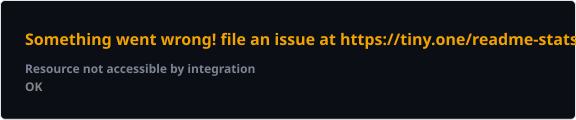

<div align="center">


<br/><br/>

<a href="https://www.linkedin.com/in/saviodomingos/" target="_blank">
  
</a>
<a href="mailto:saviocorp@gmail.com" target="_blank">
  
</a>
<a href="https://instagram.com/saviodnm" target="_blank">
  
</a>

<br/><br/>


</div>

<br/>

## `01` Sobre mim

```ts
const savio = {
  nome:       "Sávio Domingos Nogueira Moreno",
  cargo:      "Analista SharePoint @ CSP Tech",
  local:      "Niterói, Rio de Janeiro, Brasil",
  experiencia:"+3 anos em ambientes Microsoft 365",
  stack:      ["TypeScript", "React", "Next.js", "Node.js", "Docker"],
  plataforma: ["SharePoint / SPFx", "Power Apps", "Power Automate"],
  cloud:      ["AWS (Certified Cloud Practitioner)", "Azure", "Terraform"],
  ia_lowcode: ["Flowise", "n8n", "agentes de IA / LLMs"],
  foco:       "Portais corporativos · Automação de processos · Integrações via API",
};
```

- 🔭 Atuando como **Analista SharePoint** na **CSP Tech**, entregando portais corporativos, automações e integrações para empresas de médio/grande porte
- ☁️ **AWS Certified Cloud Practitioner** — também com experiência prática em Azure e Terraform (IaC)
- 🧠 Uso **Flowise**, **n8n** e agentes de IA pra orquestrar automações que economizam meses de desenvolvimento
- 🤝 Aberto a colaborar em projetos de **desenvolvimento web**, **automação** e **soluções cloud**
- 💬 Pode me chamar pra conversar sobre **tecnologia**, **automação** e **low-code / no-code**

<br/>

## `02` Trajetória

| Período | Empresa | Papel |
|---|---|---|
| jan/2024 – atual | **CSP Tech** | Analista SharePoint |
| abr/2023 – dez/2023 | CSP Tech | Estagiário Full-Stack Digital Workplace |
| set/2021 – nov/2022 | Seven Clouds | Desenvolvedor de Software Trainee (Cloud/DevOps) |
| — | Santander · Samsung | Atendimento ao cliente · Experiência do cliente |

<br/>

## `03` Stack

<table align="center">
<tr>
<td valign="top" width="33%">

**Front-end**


</td>
<td valign="top" width="33%">

**Back-end & Cloud**


</td>
<td valign="top" width="33%">

**Microsoft 365 & Design**


</td>
</tr>
</table>

<br/>

## `04` GitHub Stats

<div align="center">





</div>

<div align="center">
  
</div>

<br/>

<br/>

<div align="center">

</div>
