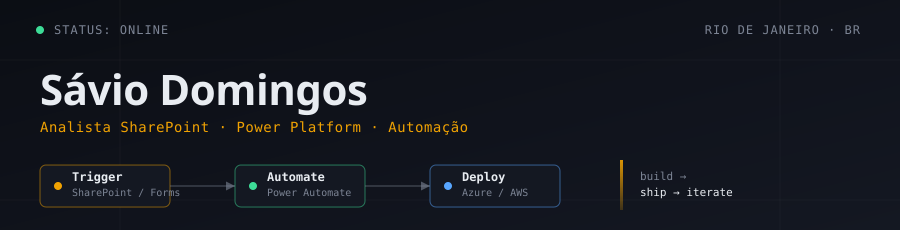

<div align="center">



<br/><br/>

<a href="https://www.linkedin.com/in/saviodomingos/" target="_blank">
  
</a>
<a href="mailto:saviocorp@gmail.com" target="_blank">
  
</a>
<a href="https://instagram.com/saviodnm" target="_blank">
  
</a>

<br/><br/>


</div>

<br/>

## `01` Sobre mim

```ts
const savio = {
  cargo:     "Analista SharePoint @ CSP Tech",
  stack:     ["TypeScript", "React", "Next.js", "Node.js", "Python"],
  plataforma:["SharePoint / SPFx", "Power Platform", "Power Automate"],
  cloud:     ["AWS", "Azure"],
  foco:      "Soluções escaláveis · Automação · Low-code / No-code",
  agora:     "Evoluindo em Cloud, React e integrações enterprise",
};
```

- 🔭 Atuando como **Analista SharePoint** na **CSP Tech**
- ☁️ Evoluindo em **Cloud (AWS / Azure)**, **Node.js**, **React** e **SPFx**
- 🤝 Aberto a colaborar em projetos de **desenvolvimento web**, **automação** e **soluções cloud**
- 💬 Pode me chamar pra conversar sobre **tecnologia**, **automação** e **low-code / no-code**

<br/>

## `02` Stack

<table align="center">
<tr>
<td valign="top" width="33%">

**Front-end**


</td>
<td valign="top" width="33%">

**Back-end & Cloud**


</td>
<td valign="top" width="33%">

**Microsoft 365 & Design**


</td>
</tr>
</table>

<br/>

## `03` GitHub Stats

<div align="center">


</div>

<div align="center">
  
</div>

<br/>

<div align="center">
  
</div>

<br/>

<div align="center">

</div>
